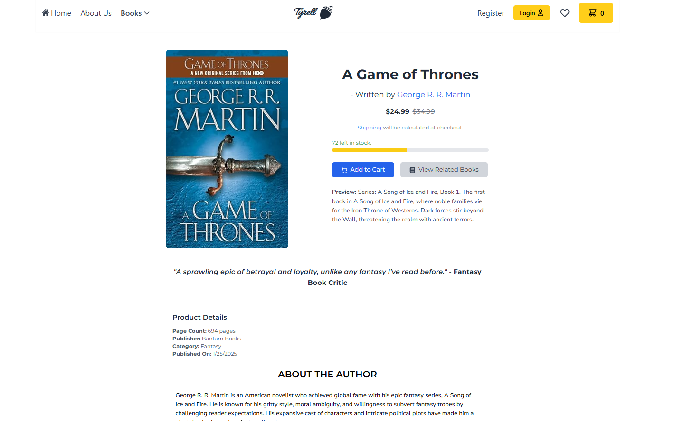
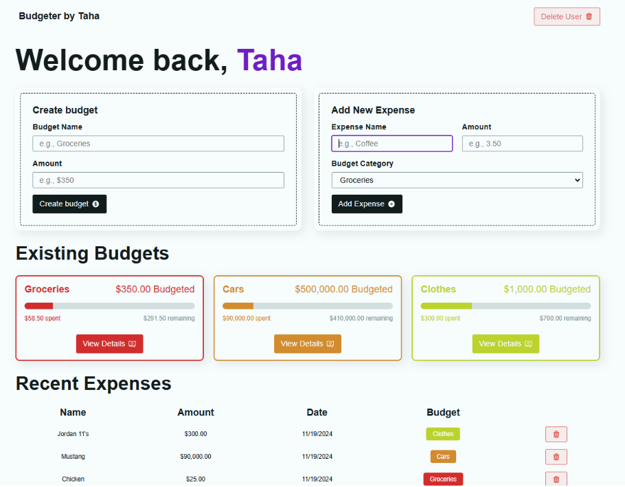
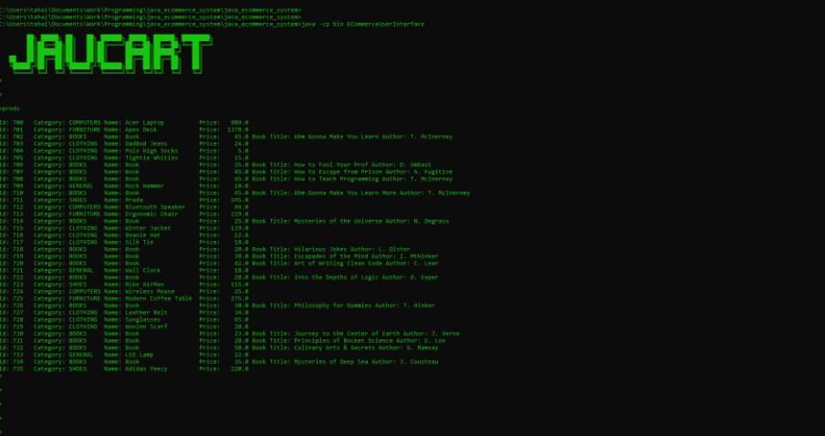
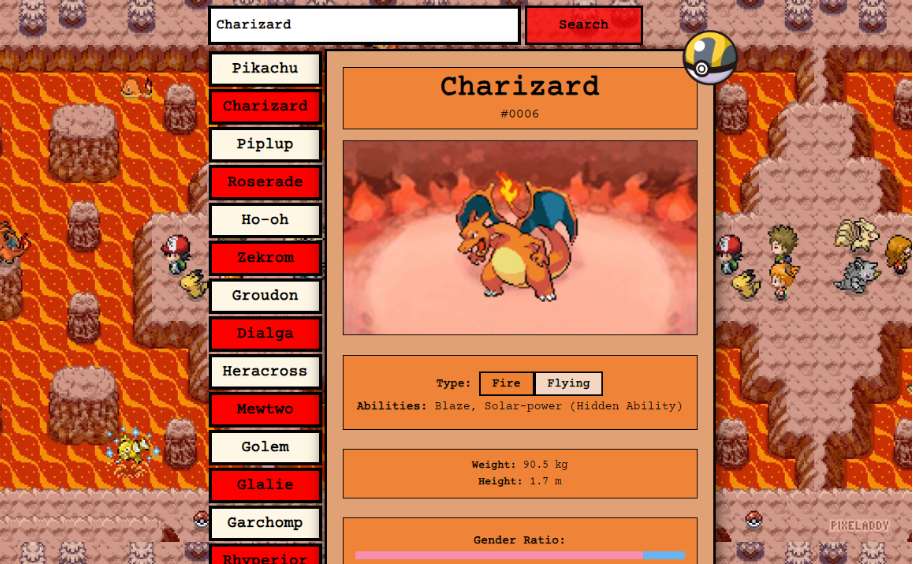
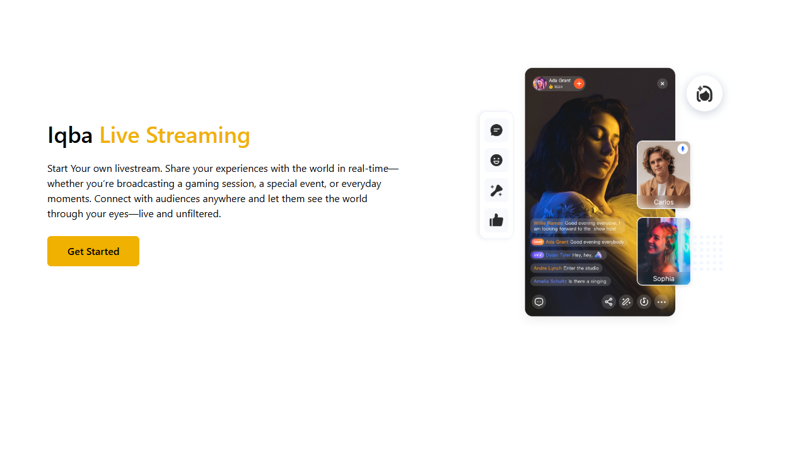

# 🥑 Taha Iqbal

**`Computer Science Co-op Student (Full Stack and Test Automation Developer)`**

Hi I'm Taha Iqbal. I'm a 3rd year computer sceince student at TMU (Toronto Metropolitan University). My interest are full-stack developement and test automation. I have professional experience as a SDET at Johnson Controls. 

All coding projects are built from the ground up, from planning and designing all the way to solving real-life problems with code. 

### 🧰 Languages and Tools

 

### 🏗️ My GitHub Projects

<!-- BEGIN GITHUB-CARDS -->

<!-- END GITHUB-CARDS -->

